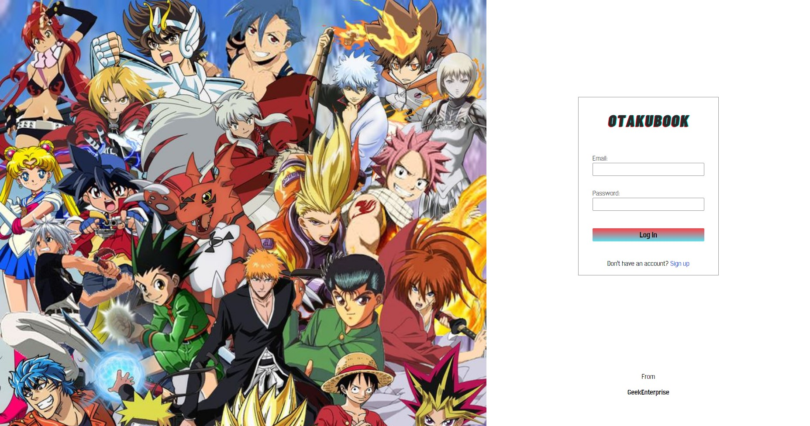
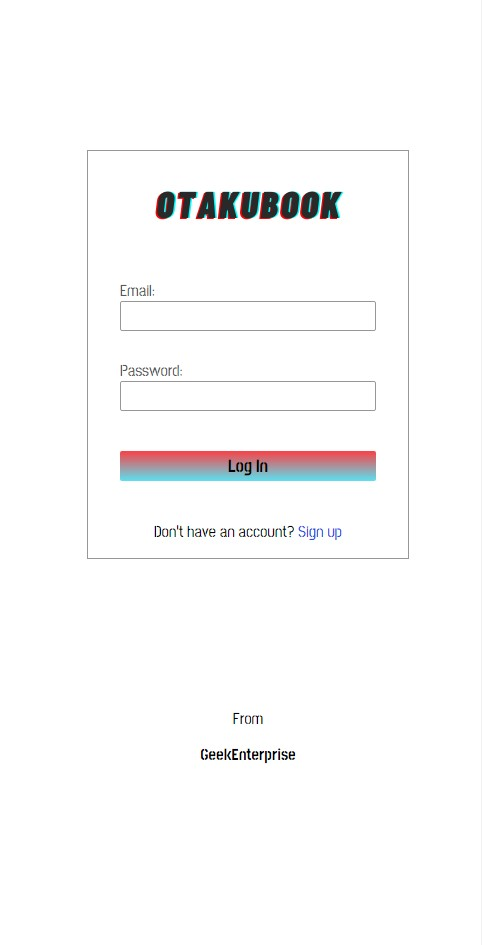

# Login page 👍🏻

<p align="center">

</p>




## Project Description

Website developt to be a personal project. It is a responsive login page of a social media for otakus :)

## How to run it locally

### Install

Clone this repository and install it dependencies with this command:

```
 npm install
```

### Running

Run the application with npm start command, it will start the app on localhost:3000:

```
 npm start
```

## ✔️ Technologies and techniques used

- `REACT`
- `Prop-types`
- `Styled Components`
- `Componentization`
